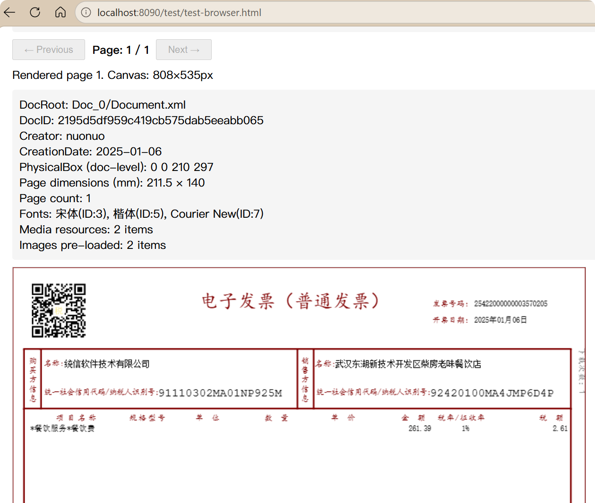

# @sharp9/ofdjs

JavaScript OFD（开放版式文档, Open Fixed Document）阅读器 — 解析并将 OFD 文档渲染到 Canvas。

OFD 是中国版式文档国家标准（GB/T 33190-2016），广泛用于**电子发票**、政务文档和商业表单。

**[English](README.md)** | **[中文](README.zh.md)**

## 功能特性

- ✅ 解析 OFD ZIP 文档（OFD.xml → Document.xml → Page.xml）
- ✅ 将 OFD 页面渲染到 HTML5 Canvas2D
- ✅ 文字渲染支持完整定位（DeltaX/DeltaY、ReadDirection、CharDirection、HScale、CTM）
- ✅ 竖排文字布局（通过 DeltaY 或 ReadDirection=90）
- ✅ 逐字符描边渲染（与填充布局一致）
- ✅ 路径渲染（基于 Boundary 的矩形）
- ✅ 图片渲染（PNG/JPG 嵌入资源）
- ✅ 模板页面（背景/前景图层合并，用于表格布局）
- ✅ 注释/印章渲染
- ✅ 同时支持**浏览器**和 **Node.js** 环境


## 安装

```bash
npm install @sharp9/ofdjs
```

需要在 Node.js 中进行服务端渲染的用户，还应安装 canvas：

```bash
npm install canvas linkedom   # 可选，用于 Node.js 渲染
```

浏览器用户通过 CDN 加载 JSZip 即可，无需额外的 npm 包。

## 使用方法

### 浏览器

```html
<!-- 通过 CDN 加载 JSZip（必须依赖） -->
<script src="https://cdn.jsdelivr.net/npm/jszip@3/dist/jszip.min.js"></script>

<script type="module">
  import { readOfd, renderPageToCanvas, getPageCount } from '@sharp9/ofdjs';

  const fileInput = document.querySelector('#ofd-file');
  const canvas = document.querySelector('#ofd-canvas');

  fileInput.addEventListener('change', async (e) => {
    const ofd = await readOfd(e.target.files[0]);
    const pageCount = getPageCount(ofd);
    await renderPageToCanvas(ofd, 0, canvas, { dpi: 150 });
  });
</script>
```

### Node.js

```js
import { initDOMParser } from '@sharp9/ofdjs/xml-parser.js';
import { readOfd, renderPageToCanvas, getPageCount, getPageDimensions } from '@sharp9/ofdjs';
import { createCanvas } from 'canvas';
import fs from 'fs';

// 初始化 Node.js ESM 环境的 DOMParser
await initDOMParser();

const buffer = fs.readFileSync('发票.ofd');
const ofd = await readOfd(new Uint8Array(buffer));

const dims = await getPageDimensions(ofd, 0);
const canvas = createCanvas(
  Math.round(dims.width * 96 / 25.4),
  Math.round(dims.height * 96 / 25.4)
);
await renderPageToCanvas(ofd, 0, canvas, { dpi: 96 });

const pngBuffer = canvas.toBuffer('image/png');
fs.writeFileSync('page0.png', pngBuffer);
```

## API 接口

| 函数 | 说明 |
|------|------|
| `readOfd(source)` | 解析 OFD 文件。`source` 支持 File、Blob、ArrayBuffer 或 URL 字符串 |
| `renderPageToCanvas(ofd, pageIndex, canvas, options?)` | 将指定页面渲染到 Canvas |
| `renderOfdToCanvas(ofd, canvas, options?)` | 依次渲染所有页面 |
| `exportOfdToPng(ofd, pageIndex?, options?)` | 导出页面为 PNG Blob |
| `getPageCount(ofd)` | 获取页数 |
| `getPageDimensions(ofd, pageIndex?)` | 获取页面尺寸（毫米） |
| `initDOMParser()` | 为 Node.js ESM 初始化 DOMParser（在其他函数之前调用） |

### 渲染选项

| 选项 | 默认值 | 说明 |
|------|--------|------|
| `dpi` | 97 | 每英寸点数，用于毫米→像素转换 |
| `scale` | 1 | 附加缩放因子 |

## 依赖说明

| 包名 | 是否必需 | 运行环境 | 用途 |
|------|----------|----------|------|
| jszip | 必需 | 两者 | ZIP 文档解析（OFD 文件本质是 ZIP 包） |
| linkedom | 可选 | Node.js | DOMParser 多态填充，用于 XML 解析 |
| @xmldom/xmldom | 可选 | Node.js | DOMParser 替代多态填充 |
| canvas | 可选 | Node.js | 服务端 Canvas 渲染（node-canvas） |

在**浏览器**中，JSZip 可通过 `<script>` CDN 标签加载，无需安装任何 npm 包。

在 **Node.js** 中，`linkedom` 或 `@xmldom/xmldom` 提供 DOMParser，`canvas` 提供 Canvas2D API。这些均为可选依赖——未安装时仍可解析 OFD 文件，但无法渲染页面。

## 支持的 OFD 功能

- **TextObject**：完整定位支持 DeltaX/DeltaY、ReadDirection（LTR/RTL/竖排）、CharDirection、HScale、Weight、Italic、Alpha、CTM、Stroke
- **PathObject**：基于 Boundary 的矩形渲染（带填充/描边）
- **ImageObject**：PNG/JPG 嵌入图片渲染
- **Template 页面**：背景/前景图层合并
- **注释**：印章渲染
- **颜色**：RGB 整数格式、十六进制格式，支持 Alpha

## 当前限制

- **AbbreviatedData**（PathObject 中的 SVG 路径命令）未解析——路径仅渲染为矩形
- **CTM** 未应用于 PathObject
- **JBIG2、TIFF、BMP** 图片格式暂不支持
- **CJS/require()** 不支持——本包仅支持 ESM
- 中文字体（楷体、宋体、黑体）在 Node.js canvas 中可能不可用——回退为 sans-serif

## 项目结构

```
src/
  index.js         — 公开 API 入口
  ofd.js           — OFD.xml 根节点解析
  document.js      — Document.xml + 资源解析
  elements.js      — 页面元素类型（TextObject、PathObject 等）
  page.js          — Page.xml 解析
  render.js        — Canvas2D 渲染实现
  types.js         — 坐标辅助工具（Box、Color、Matrix、mmtopx）
  xml-parser.js    — DOMParser 多态填充 + XML 解析工具
  path-resolver.js — ZIP 路径解析
test/
  test-browser.html — 浏览器演示/测试页面
  fixtures/         — 示例 OFD 文件
```

## 开发

```bash
# 安装依赖
npm install

# 运行快速导入测试
npm test

# 在 Node.js 中渲染示例 OFD 文件
node -e "
  import('./src/index.js').then(m => console.log('Exports:', Object.keys(m).join(', ')));
"
```

浏览器测试：使用本地 Web 服务器提供 `test/test-browser.html`，然后在浏览器中打开。

## 许证

Apache
